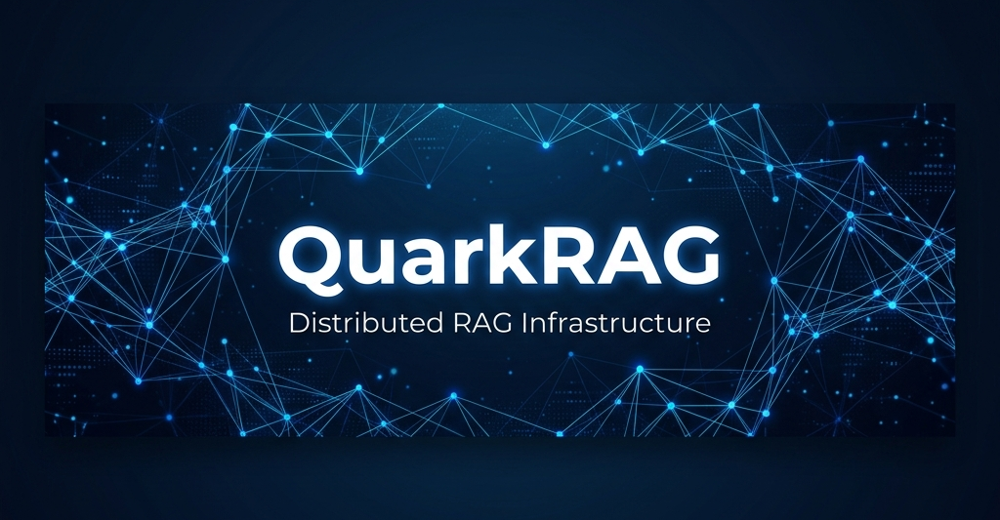
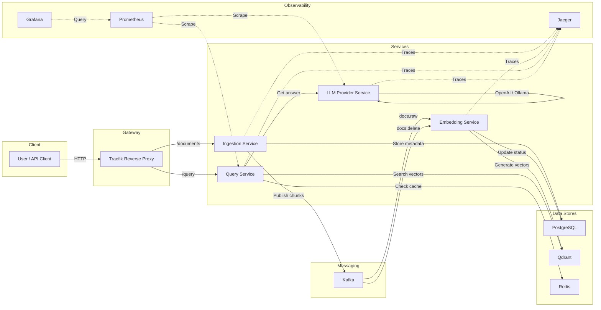

<p align="center">
  
</p>

<p align="center">
  <strong>A production-grade, distributed microservice platform for Retrieval-Augmented Generation.</strong>
</p>

<p align="center">
  <a href="https://github.com/SepehrGhr/QuarkRAG/actions/workflows/ci-cd.yml">
    
  </a>
  &nbsp;
  <a href="https://github.com/SepehrGhr/QuarkRAG">
    
  </a>
  &nbsp;
  <a href="https://github.com/SepehrGhr/QuarkRAG/blob/main/LICENSE">
    
  </a>
  &nbsp;
  <a href="https://github.com/SepehrGhr/QuarkRAG">
    
  </a>
</p>

<br/>

## 📖 Overview

**QuarkRAG** is an event-driven, microservice-based platform that implements the full Retrieval-Augmented Generation (RAG) pipeline — from document ingestion and chunking, through vector embedding and storage, to semantic search and LLM-powered answer generation. Every component is independently deployable, horizontally scalable, and observable out of the box.

> **Why "Quark"?** — Just as quarks are the fundamental building blocks of matter, QuarkRAG breaks the RAG pipeline into its smallest, most composable units — microservices — so you can assemble, scale, and swap each piece independently.

<br/>

## ✨ Key Features

<table>
<tr>
<td width="50%">

### 🏗️ Microservice Architecture
Four decoupled FastAPI services communicate via Kafka event streams, each with its own Dockerfile and independent scaling.

### 🧠 Multi-Provider Embeddings
Swap between **OpenAI**, **Ollama** (local), or any **OpenAI-compatible API** (e.g., OpenRouter) with a single environment variable.

### ⚡ Semantic Vector Search
Powered by **Qdrant** — a high-performance vector database — for blazing-fast similarity search across millions of document chunks.

</td>
<td width="50%">

### 🔄 Event-Driven Pipeline
**Apache Kafka** decouples ingestion from embedding, enabling async processing, retry semantics, and a dead-letter queue for failed events.

### 🚀 Redis Caching
Query responses are cached in **Redis**, delivering sub-millisecond responses for repeated questions and reducing LLM costs.

### 📊 Full Observability Stack
**Prometheus** metrics, **Grafana** dashboards, and **Jaeger** distributed tracing — all pre-configured and ready to deploy.

</td>
</tr>
</table>

<br/>

## 🏛️ Architecture



<br/>

## 🧩 Services

| Service | Port | Description |
|---|---|---|
| **Ingestion** | `8000` (via Traefik) | Accepts document uploads, chunks them (recursive or markdown), stores metadata in PostgreSQL, and publishes chunks to Kafka. |
| **Embedding** | Internal | Consumes raw chunks from Kafka, generates vector embeddings (OpenAI / Ollama / OpenRouter), and stores them in Qdrant. |
| **LLM Provider** | Internal | Proxies completion requests to OpenAI or Ollama with circuit-breaker fault tolerance and Prometheus metrics. |
| **Query** | `8000` (via Traefik) | Embeds user questions, performs vector similarity search in Qdrant, calls the LLM provider for answer synthesis, and caches results in Redis. |

<br/>

## 🛠️ Tech Stack

<p align="center">
  
  
  
  
  
  
  
  
  
  
  
  
</p>

<br/>

## 🚀 Quick Start

### Prerequisites

- [Docker](https://docs.docker.com/get-docker/) & [Docker Compose](https://docs.docker.com/compose/install/)
- An API key from **OpenAI**, **OpenRouter**, or a local **Ollama** instance

### 1. Clone & Configure

```bash
git clone https://github.com/SepehrGhr/QuarkRAG.git
cd QuarkRAG

# Copy the example environment file and fill in your keys
cp .env.example .env
```

Edit `.env` with your preferred provider:

<details>
<summary><strong>🔑 OpenAI (default)</strong></summary>

```env
EMBEDDING_PROVIDER=openai
OPENAI_API_KEY=sk-your-key-here
OPENAI_API_BASE=https://api.openai.com/v1
OPENAI_EMBEDDING_MODEL_NAME=text-embedding-3-small
OPENAI_EMBEDDING_DIMENSION=1536
```

</details>

<details>
<summary><strong>🌐 OpenRouter (free models available)</strong></summary>

```env
EMBEDDING_PROVIDER=openai
OPENAI_API_KEY=sk-or-v1-your-openrouter-key
OPENAI_API_BASE=https://openrouter.ai/api/v1
OPENAI_EMBEDDING_MODEL_NAME=nvidia/llama-nemotron-embed-vl-1b-v2:free
OPENAI_EMBEDDING_DIMENSION=2048
```

</details>

<details>
<summary><strong>🦙 Ollama (fully local, no API key needed)</strong></summary>

```env
EMBEDDING_PROVIDER=ollama
OLLAMA_URL=http://host.docker.internal:11434
OLLAMA_EMBEDDING_MODEL_NAME=nomic-embed-text
OLLAMA_EMBEDDING_DIMENSION=768
OLLAMA_MODEL_NAME=llama3.2:3b
```

</details>

### 2. Launch the Platform

```bash
# Start all core services
docker compose up -d --build

# (Optional) Start the observability stack
docker compose -f docker-compose.obs.yml up -d
```

### 3. Verify Health

```bash
# Check that all services are healthy
docker compose ps

# Quick health check
curl http://localhost:8000/documents  # → Should return {"documents": []}
```

<br/>

## 📡 API Reference

All API endpoints are exposed through the **Traefik** gateway on port `8000`.

### Document Ingestion

| Method | Endpoint | Description |
|---|---|---|
| `POST` | `/documents/upload` | Upload and chunk a document |
| `GET` | `/documents` | List all documents (optional `namespace` and `status` filters) |
| `GET` | `/documents/{id}` | Get document details by ID |
| `DELETE` | `/documents/{id}` | Delete a document and its vectors |

#### Upload a Document

```bash
curl -X POST http://localhost:8000/documents/upload \
  -F "file=@my_document.txt" \
  -F "namespace=research" \
  -F "chunking_strategy=recursive"
```

### Query

| Method | Endpoint | Description |
|---|---|---|
| `POST` | `/query` | Ask a question against your ingested documents |

#### Ask a Question

```bash
curl -X POST http://localhost:8000/query \
  -H "Content-Type: application/json" \
  -d '{
    "question": "What are the key findings?",
    "namespace": "research",
    "top_k": 5
  }'
```

<br/>

## 📂 Project Structure

```
QuarkRAG/
├── services/
│   ├── ingestion/          # Document upload, chunking, Kafka publishing
│   │   ├── chunking/       # Recursive & Markdown splitters
│   │   ├── kafka/          # Kafka producer
│   │   ├── models/         # SQLAlchemy ORM models
│   │   ├── routers/        # FastAPI route handlers
│   │   └── schemas/        # Pydantic request/response schemas
│   ├── embedding/          # Vector embedding pipeline
│   │   ├── consumer/       # Kafka consumers (docs.raw, docs.delete)
│   │   ├── embedders/      # OpenAI, Ollama, Local embedder adapters
│   │   ├── qdrant/         # Qdrant client & collection management
│   │   └── database.py     # PostgreSQL status updates
│   ├── llm_provider/       # LLM gateway with circuit breaker
│   │   ├── circuit_breaker/# Fault tolerance logic
│   │   ├── providers/      # OpenAI & Ollama provider adapters
│   │   └── routers/        # /generate endpoint
│   └── query/              # Semantic search & answer generation
│       ├── cache/          # Redis caching layer
│       ├── embedders/      # Query-time embedding
│       ├── search/         # Qdrant similarity search
│       └── startup/        # Embedding dimension validation
├── infra/
│   ├── grafana/            # Dashboard provisioning
│   ├── k8s/                # Kubernetes manifests
│   ├── prometheus/         # Metrics & alerting rules
│   └── traefik/            # API gateway configuration
├── migrations/             # Alembic database migrations
├── tests/                  # Unit tests for all services
├── docker-compose.yml      # Core platform services
└── docker-compose.obs.yml  # Observability stack (Prometheus, Grafana, Jaeger)
```

<br/>

## 📊 Observability

QuarkRAG ships with a full observability stack:

| Tool | Port | Purpose |
|---|---|---|
| **Grafana** | `3000` | Pre-configured dashboards for query latency, cache hit rates, and service health |
| **Prometheus** | `9090` | Metrics collection with custom alert rules |
| **Jaeger** | `16686` | Distributed tracing across all services via OpenTelemetry |

```bash
# Launch the observability stack
docker compose -f docker-compose.obs.yml up -d

# Open Grafana → http://localhost:3000 (admin/admin)
# Open Jaeger  → http://localhost:16686
```

<br/>

## ☸️ Kubernetes Deployment

QuarkRAG includes production-ready Kubernetes manifests with network policies for secure inter-service communication:

```bash
cd infra/k8s
chmod +x apply.sh
./apply.sh
```

The manifests include namespace isolation, ConfigMaps, Secrets, and resource limits for all services and data stores.

<br/>

## 🧪 Testing

```bash
# Run unit tests inside the Docker containers
docker compose exec embedding-service pytest /app/tests/unit/embedding -v
docker compose exec ingestion-service pytest /app/tests/unit/ingestion -v
docker compose exec llm-provider-service pytest /app/tests/unit/llm_provider -v
docker compose exec query-service pytest /app/tests/unit/query -v
```

All tests use mocked dependencies (no running LLM, embedding model, or external API needed).

<br/>

## 🤝 Contributing

Contributions are welcome! Please feel free to submit a pull request. For major changes, open an issue first to discuss what you would like to change.

1. Fork the repository
2. Create your feature branch (`git checkout -b feature/amazing-feature`)
3. Commit your changes (`git commit -m 'Add amazing feature'`)
4. Push to the branch (`git push origin feature/amazing-feature`)
5. Open a Pull Request

<br/>

## 📄 License

Distributed under the MIT License. See `LICENSE` for more information.

<br/>

---

<p align="center">
  Built with ❤️ by <a href="https://github.com/SepehrGhr">Sepehr</a>
</p>
